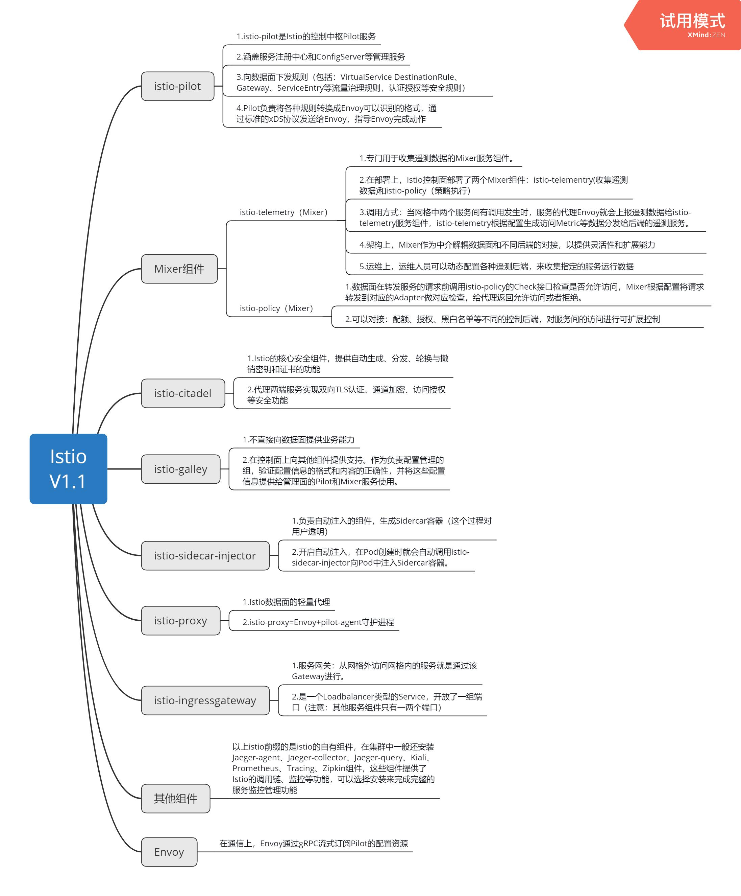
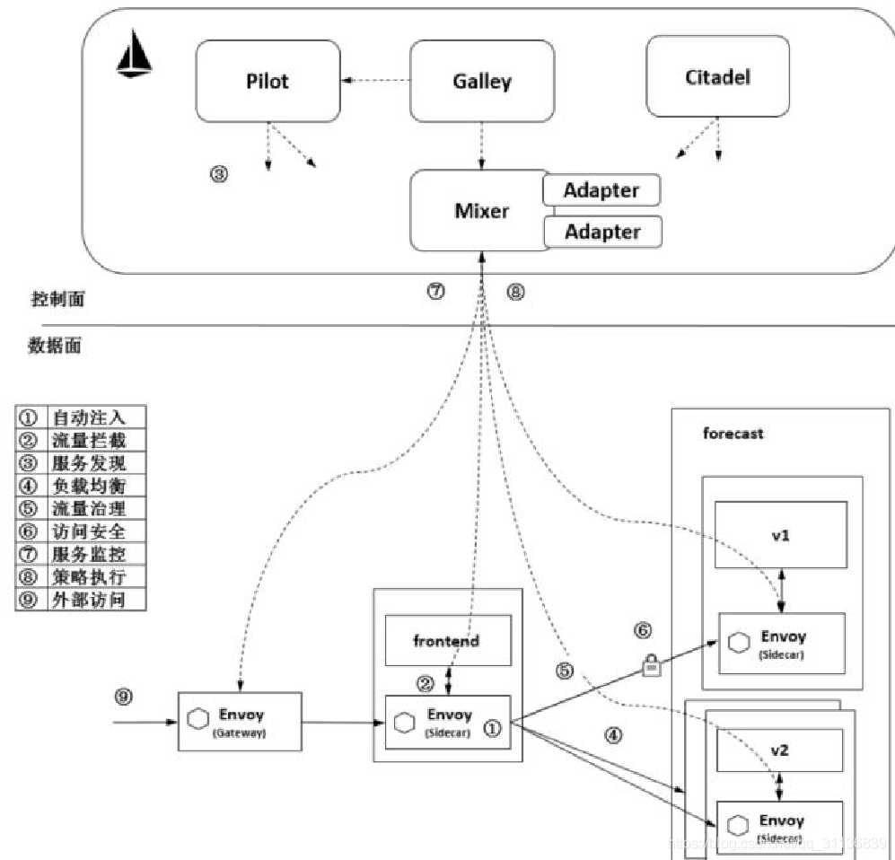
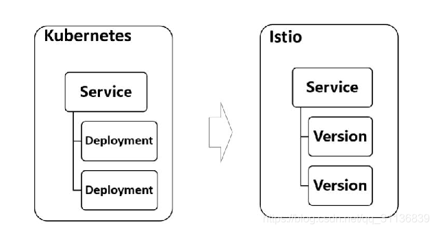
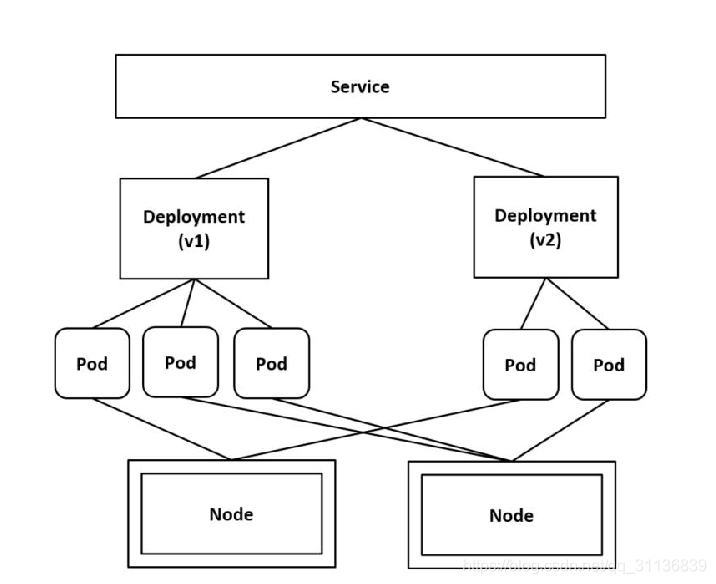
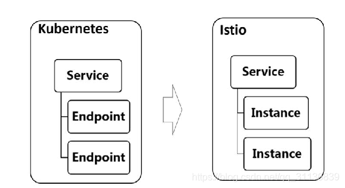
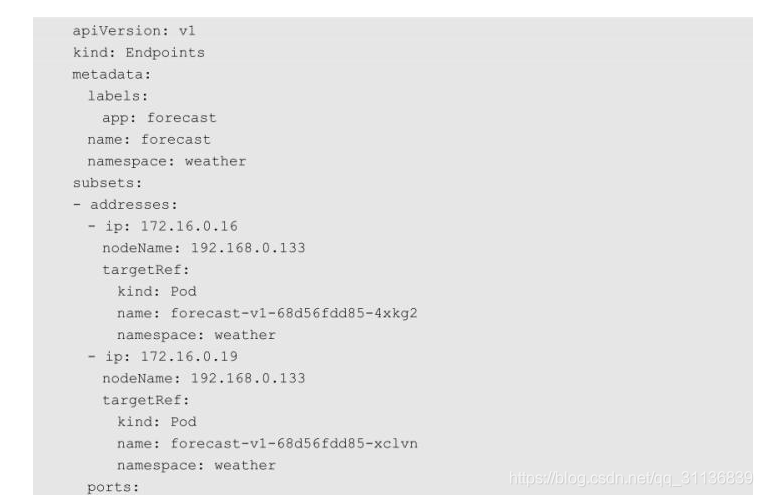

# Istio架构概述

前面的内容分别讲解了Istio是什么，以及Istio能做什么。本章将在此基础上进行Istio的架构概述，包括 Istio 的工作机制、服务模型和主要组件，为学习流量治理、策略与遥测、访问安全等内容做必要的知识储备。



## 2.1 Istio的工作机制

图2-1展示了Istio的工作机制和架构，分为控制面和数据面两部分。可以看到，控制面主要包括Pilot、Mixer、Citadel等服务组件；数据面由伴随每个应用程序部署的代理程序Envoy组成，执行针对应用程序的治理逻辑。为了避免静态、刻板地描述组件，在介绍组件的功能前，我们先通过一个动态场景来了解图2-1中对象的工作机制，即观察frontend服务对 forecast 服务进行一次访问时，在 Istio 内部都发生了什么，以及 Istio 的各个组件是怎样参与其中的，分别做了哪些事情。

图2-1上带圆圈的数字代表在数据面上执行的若干重要动作。虽然从时序上来讲，控制面的配置在前，数据面执行在后，但为了便于理解，在下面介绍这些动作时以数据面上的数据流为入口，介绍数据面的功能，然后讲解涉及的控制面如何提供对应的支持，进而理解控制面上组件的对应功能。

（1）自动注入：指在创建应用程序时自动注入 Sidecar代理。在 Kubernetes场景下创建 Pod时，Kube-apiserver调用管理面组件的 Sidecar-Injector服务，自动修改应用程序的描述信息并注入Sidecar。在真正创建Pod时，在创建业务容器的同时在Pod中创建Sidecar容器。



​                         **图2-1 Istio的工作机制和架构**

（2）流量拦截：在 Pod 初始化时设置 iptables 规则，当有流量到来时，基于配置的iptables规则拦截业务容器的Inbound流量和Outbound流量到Sidecar上。应用程序感知不到Sidecar的存在，还以原本的方式进行互相访问。在图2-1中，流出frontend服务的流量会被 frontend服务侧的 Envoy拦截，而当流量到达forecast容器时，Inbound流量被forecast服务侧的Envoy拦截。

（3）服务发现：服务发起方的 Envoy 调用管理面组件 Pilot 的服务发现接口获取目标服务的实例列表。在图 2-1 中，frontend 服务侧的 Envoy 通过 Pilot 的服务发现接口得到forecast服务各个实例的地址，为访问做准备。

（4）负载均衡：服务发起方的Envoy根据配置的负载均衡策略选择服务实例，并连接对应的实例地址。在图2-1中，数据面的各个Envoy从Pilot中获取forecast服务的负载均衡配置，并执行负载均衡动作。

（5）流量治理：Envoy 从 Pilot 中获取配置的流量规则，在拦截到 Inbound 流量和Outbound 流量时执行治理逻辑。在图 2-1 中，frontend 服务侧的 Envoy 从 Pilot 中获取流量治理规则，并根据该流量治理规则将不同特征的流量分发到forecast服务的v1或v2版本。当然，这只是Istio流量治理的一个场景，更丰富的流量治理能力后续讲解。

（6）访问安全：在服务间访问时通过双方的Envoy进行双向认证和通道加密，并基于服务的身份进行授权管理。在图2-1中，Pilot下发安全相关配置，在frontend服务和forecast服务的Envoy上自动加载证书和密钥来实现双向认证，其中的证书和密钥由另一个管理面组件Citadel维护。

（7）服务遥测：在服务间通信时，通信双方的Envoy都会连接管理面组件Mixer上报访问数据，并通过Mixer将数据转发给对应的监控后端。在图2-1中，frontend服务对forecast服务的访问监控指标、日志和调用链都可以通过这种方式收集到对应的监控后端。

（8）策略执行：在进行服务访问时，通过Mixer连接后端服务来控制服务间的访问，判断对访问是放行还是拒绝。在图2-1中，Mixer后端可以对接一个限流服务对从frontend服务到forecast服务的访问进行速率控制。

（9）外部访问：在网格的入口处有一个Envoy扮演入口网关的角色。在图2-1中，外部服务通过Gateway访问入口服务 frontend，对 frontend服务的负载均衡和一些流量治理策略都在这个Gateway上执行。

这里总结在以上过程中涉及的动作和动作主体，可以将其中的每个过程都抽象成一句话：服务调用双方的Envoy代理拦截流量，并根据管理面的相关配置执行相应的治理动作，这也是Istio的数据面和控制面的配合方式。

## 2.2 Istio的服务模型

刚才介绍服务发现、负载均衡、流量治理等过程时提到了 Istio 的服务、服务版本和服务实例等几个对象。这几个对象构成了 Istio 的服务模型，在介绍后面的内容前先对服务模型做下简要介绍。Istio支持将由服务、服务版本和服务实例构造的抽象模型映射到不同的平台上，这里重点关注基于Kubernetes的场景。可以认为，Istio的几个资源对象就是基于Kubernetes的相应资源对象构建的，加上部分约束来满足Istio服务模型的要求。

Istio 官方对这几个约束的描述如下。如果从较早版本就开始关注 Istio 的话，会注意到这些约束其实已经慢慢减少了，即功能增强则约束减少，但保留了某些原理上的约束。

◎ 端口命名：对 Istio 的服务端口必须进行命名，而且名称只允许是＜protocol＞[-＜suffix＞]这种格式，其中＜protocol＞可以是tcp、http、http2、https、grpc、tls、mongo、mysql、redis等，Istio根据在端口上定义的协议来提供对应的路由能力。例如“name：http2-forecast”和“name：http”是合法的端口名，但是“name：http2forecast”是非法的端口名。如果端口未命名或者没有基于这种格式进行命名，则端口的流量会被当作TCP流量来处理。
◎ 服务关联：Pod 需要关联到服务，如果一个 Pod 属于多个 Kubernetes 服务，则要求服务不能在同一个端口上使用不同的协议。在 Istio 0.8 之前的版本中要求一个Pod 只能属于一个 Kubernetes 服务，这种约束更简单，也更能满足绝大多数使用要求。
◎ Deployment使用app和version标签：建议Kubernetes Deployment显式地包含app和 version 标签。每个 Deployment 都需要有一个有业务意义的 app 标签和一个表示版本的version标签。在分布式追踪时可以通过app标签来补齐上下文信息，还可以通过app和version标签为遥测数据补齐上下文信息。

### 2.2.1 Istio的服务

从逻辑上看，服务是Istio主要管理的资源对象，是一个抽象概念，主要包含HostName和Ports等属性，并指定了Service的域名和端口列表。每个端口都包含端口名称、端口号和端口的协议。

同的协议有不同的内容，相应地，在 Istio 中对不同的协议也有不同的治理规则集合，这也是Istio关于端口命名约束的机制层面的原因，具体来讲就是要求将端口的协议通过“-”连接符加在端口名称上。

从物理层面看，Istio服务的存在形式就是Kubernetes的Service，在启用了Istio的集群中创建 Kubernetes的 Service时只要满足以上约束，就可以转换为 Istio的 Service并配置规则进行流量治理。

Service是Kubernetes的一个核心资源，用户通过一个域名或者虚拟的IP就能访问到后端Pod，避免向用户暴露Pod地址的问题，特别是在Kubernetes中，Pod作为一个资源创建、调度和管理的最小部署单元的封装，本来就是动态变化的，在节点删除、资源变化等多种情况下都可能被重新调度，Pod的后端地址也会随之变化。

一个最简单的Service示例如下：

```yaml
apiVersion: v1
kind: Service
metadata:
  name: forecast
spec:
  ports:
  - port: 3002
    targetPort: 3002
  selector:
    app: forecast
```

如上所示创建了一个名称为 forecast 的 Service，通过一个 ClusterIP 的地址就可以访问这个Service，指向有“app：forecast”标签的Pods。Kubernetes自动创建一个和Service同名的Endpoints对象，Service的selector会持续关注属于Service的Pod，结果会被更新到相应的Endpoints对象。

Istio的Service比较简单，可以看到差别就是要满足Istio服务的约束，并在端口名称上指定协议。例如，在以下示例中指定了forecast服务的3002端口是HTTP，对这个服务的访问就可以应用HTTP的诸多治理规则：

```yaml
apiVersion: v1
kind: Service
metadata:
  name: forecast
spec:
  ports:
  - port: 3002
    targetPort: 3002
    bane: http
  selector:
    app: forecast
```

Istio虽然依赖于了Kubernetes的Service定义，但是除了一些约束，在定位上还有些差别。在 Kubernetes中，一般先通过 Deploymnent创建工作负载，再通过创建 Service关联这些工作负载，从而暴露工作负载的接口。因而看上去主体是工作负载，Service只是一种访问方式，某些后台执行的负载若不需要被访问，就不用定义Service。在Istio中，Service是治理的对象，是Istio中的核心管理实体，所以在Istio中，Service是一个提供了对外访问能力的执行体，可以将其理解为一个定义了服务的工作负载，没有访问方式的工作负载不是Istio的管理对象，Kubernetes的Service定义就是Istio服务的元数据。

### 2.2.2 Istio的服务版本

在Istio的应用场景中，灰度发布是一个重要的场景，即要求一个Service有多个不同版本的实现。而 Kubernetes在语法上不支持在一个 Deployment上定义多个版本，在 Istio中多个版本的定义是将一个Service关联到多个Deployment，每个Deployment都对应服务的一个版本，如图2-2所示。



​                           **图2-2 Istio服务版本**

在下面的实例中，forecast-v1 和 forecast-v2 这两个 Deployment 分别对应服务的两个版本：

```yaml
---
apiVersion: extensions/v1beta1
kind: Deployment
metadata:
  name: forecast-v1
  labels:
    app: forecast
    version: v1
spec: 
  replicas: 3
  template:
    metadata:
      labels:
        app: forecast
        version: v1
    spec:
      containers:
      - name: forecast
        image: istioweather/forecast:v1
        ports:
        - containerPort: 3002

---

apiVersion: extensions/v1beta1
kind: Deployment
metadata：
  name: forecast-v2
  labels:
    app: forecast
    version: v2
spec:
  replicas: 2
  template:
    metadata:
      labels:
        app: forecast
        version: v2
    spec:
      containers:
      - name: forecast
        image: istioweather/forecast:v2
        ports:
        - containerPort: 3002

```

观察和比较这两个Deployment的描述文件，可以看到：

◎ 这两个Deployment都有相同的“app：forecast”标签，正是这个标签和Service的标签选择器一致，才保证了Service能关联到两个Deployment对应的Pod。
◎ 这两个 Deployment 都有不同的镜像版本，因此各自创建的 Pod 也不同；这两个Deployment的version标签也不同，分别为v1和v2，表示这是服务的不同版本，这个不同的版本标签用来定义不同的Destination，进而执行不同的路由规则。

下面根据对Service和两个Deployment的如上定义分别创建3个Pod和两个Pod，假设5个Pod都运行在两个不同的Node上。在对Service进行访问时，根据配置的流量规则，可以将不同的流量转发到不同版本的Pod上，如图2-3所示。

 



​                            **图2-3 多版本的Service**

### Istio的服务实例

服务实例是真正处理服务请求的后端，就是监听在相同端口上的具有同样行为的对等后端。服务访问时由代理根据负载均衡策略将流量转发到其中一个后端处理。Istio 的ServiceInstance 主要包括 Endpoint、Service、Labels、AvailabilityZone 和 ServiceAccount等属性，Endpoint 是其中最主要的属性，表示这个实例对应的网络后端（ip：port），Service表示这个服务实例归属的服务。

Istio的服务发现基于Kubernetes构建，本章讲到的Istio的Service对应Kubernetes的Service，Istio的服务实例对应Kubernetes的Endpoint，如图2-4所示。



​                          **图2-4 Istio的服务实例**

Kubernetes提供了一个 Endpoints对象，这个 Endpoints对象的名称和 Service的名称相同，它是一个＜Pod IP＞：＜targetPort＞列表，负责维护Service后端Pod的变化。如前面例子中介绍的，forecast服务对应如下Endpoints对象，包含两个后端Pod，后端地址分别是172.16.0.16和 172.16.0.19，当实例数量发生变化时，对应的Subsets列表中的后端数量会动态更新；同样，当某个Pod迁移时，Endpoints对象中的后端IP地址也会更新：  



   