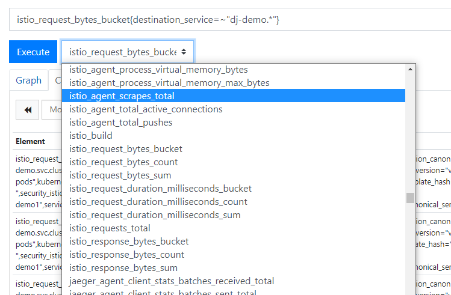
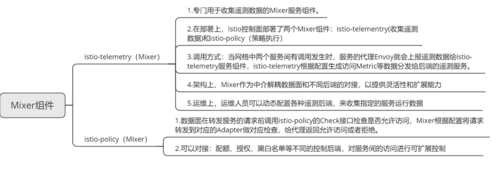
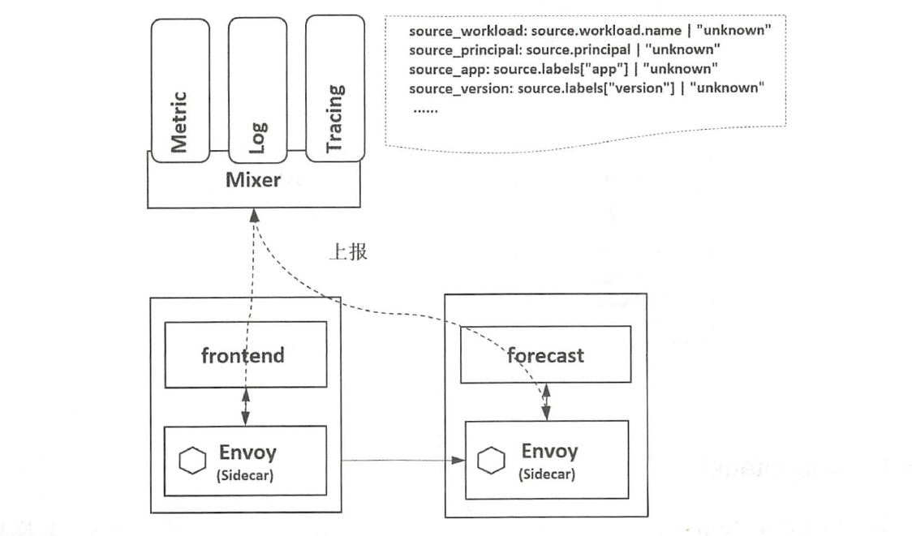

## prometheus + grafana

Prometheus是由SoundCloud开发的开源监控报警系统和时序列数据库

基本原理是通过HTTP协议周期性抓取被监控组件的状态

grafana 是提供的管理界面默认安装;http://localhost:3000/ 账号admin;密码admin

### Prometheus四种数据类型

#### Counter

Counter用于累计值，例如记录请求次数、任务完成数、错误发生次数。一直增加，不会减少。重启进程后，会被重置。

例如：http_response_total{method=”GET”,endpoint=”/api/tracks”} 100，10秒后抓取http_response_total{method=”GET”,endpoint=”/api/tracks”} 100。

#### Gauge

Gauge常规数值，例如 温度变化、内存使用变化。可变大，可变小。重启进程后，会被重置。

例如： memory_usage_bytes{host=”master-01″} 100 < 抓取值、memory_usage_bytes{host=”master-01″} 30、memory_usage_bytes{host=”master-01″} 50、memory_usage_bytes{host=”master-01″} 80 < 抓取值。

#### Histogram

Histogram（直方图）可以理解为柱状图的意思，常用于跟踪事件发生的规模，例如：请求耗时、响应大小。它特别之处是可以对记录的内容进行分组，提供count和sum全部值的功能。

例如：{小于10=5次，小于20=1次，小于30=2次}，count=7次，sum=7次的求和值。

#### Summary

Summary和Histogram十分相似，常用于跟踪事件发生的规模，例如：请求耗时、响应大小。同样提供 count 和 sum 全部值的功能。

例如：count=7次，sum=7次的值求值。

它提供一个quantiles的功能，可以按%比划分跟踪的结果。例如：quantile取值0.95，表示取采样值里面的95%数据

### 在istio中使用

istio中默认安装了Prometheus和grafana:

```
kubectl -n istio-system get svc prometheus

kubectl -n istio-system get svc grafana
```

需要映射本地端口,最好通过网关访问

查看服务状态

```
kubectl describe svc -n istio-system prometheus
kubectl describe svc -n istio-system grafana
```

patch分配端口

```
kubectl patch svc -n istio-system grafana -p '{"spec": {"type": "NodePort"}}'
kubectl patch svc -n istio-system prometheus -p '{"spec": {"type": "NodePort"}}'
```


列子:http://121.37.209.13:32169/

### 监控指标

​	可以在Prometheus中的管理界面中找到相应的指标




### 使用案例

* 查询所有服务的请求总数：istio_request_bytes_count

* 查询指定服务的请求总数：（如查询对 productpage 服务的所有请求的总数）istio_request_bytes_count{destination_service="productpage.default.svc.cluster.local"}

* 查询指定时间范围内对指定服务的请求总数：（如查询过去5分钟内对所有 productpage 服务的请求率） 

  istio_request_bytes_count {destination_service=~"productpage.*", response_code="200"}[5m])

* 查询dj-demo的请求总数istio_request_bytes_count{destination_service=~"dj-demo.*"}


## istio-telemetry

Istio 控制面部署了两个Mixer 组件： istio-telemetry 和istio-policy ，分别处理遥测数据的收集和策略的执行。查看两个组件的Pod 镜像会发现，容器的镜像是相同的，都是"/istio/mixer"



istio-telemetry服务启动时则加载/etc/istio/proxy/envoy_telemetry.yaml.tmpl模板文件

istio-telemetry则负责接收来自Envoy sidecar的report请求，该请求只做日志记录操作并响应于请求端。

Mixer 是Istio 独有的一种设计,不同于Pilot ，在其他平台上总能找到类似功能的服务组件。从调用时机上来说,Pilot 管理的是配置数据，在配置改变时和数据面交互即可；然而，对于Mixer 来说，在服务间交互时Envoy 都会对Mixer 进行一次调用，因此这是一种实时管理。当然，在实现上通过在Mixer 和Proxy 上使用缓存机制，可保证不用每次进行数据面请求时都和Mixer 交互。

stio-telemetry是专门用于收集遥测数据的Mixer服务组件;如下图所示 所示，当网格中的两个服务间有调用发生时，服务的代理Envoy 就会上报遥测数据给istio-telemetry服务组件，istio-telemetry 服务组件则根据配置将生成访问Metric等数据分发给后端的遥测服务。数据面代理通过Report 接口上报数据时访问数据会被批
量上报。



